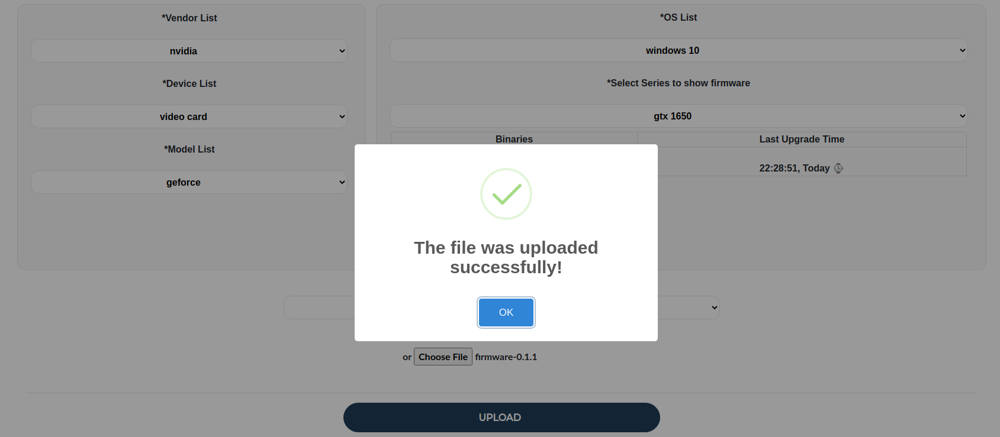

# Contents
* [About](#about)
* [Installation](#installation)
* [Tools and Technologies](#tools-and-technologies)
* [Main Features](#main-features)


# About

This sample web application, built on top of Django, is used to manage driver upgrades and connects to AWS Services. 
It allows you to upload, download, and delete drivers from manufacturers with any model, such as graphics cards, sound cards, or chipsets, as well as create and delete products.

## Tools and Technologies

* DynamoDB
* S3
* Cognito (Optional)
* Bootstrap
* Sweetalerts
* Ajax jQuery

## Installation

Use the package manager [pip](https://pip.pypa.io/en/stable/) to install foobar.

```bash
pip install -r requirements.txt
```

After included AWS Configurations to .env file and run server,tables and bucket will be created automatically in AWS.


## Main Features

### Create Single Series

### Create Multiple Series


### Upload Driver



### DynamoDb Table


## License
[GNU 3.0](https://github.com/omeraydemirr/driver-upgrade/blob/20574bfa70063ccf53e5fbc0084075671875a390/LICENSE)
